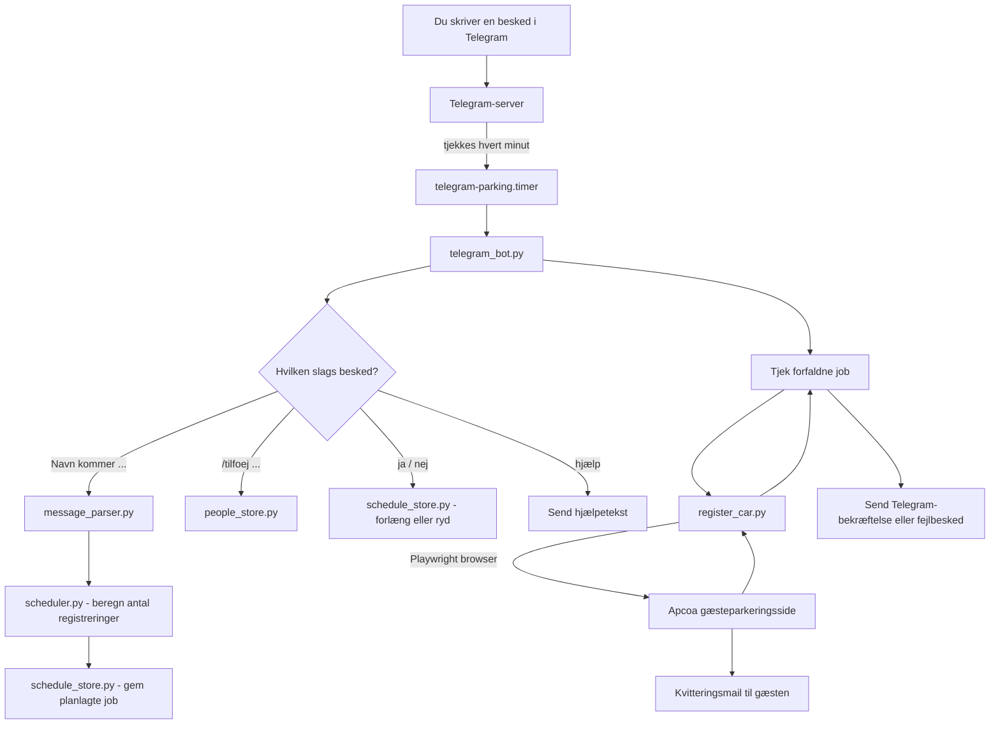

# Gæsteparkering-automatisering 🚗

Automatisk registrering af gæsteparkering (Apcoa/mobilparkering.dk) styret via Telegram — skriv en besked som "Mor kommer i morgen kl 10 til kl 20", og resten sker automatisk på en Raspberry Pi.

## Baggrundshistorien

Første version af dette projekt forsøgte at opdage gæster automatisk ved at scanne det lokale netværk for kendte telefoners MAC-adresser (`scan_and_register.py`). Det virkede i teorien, men i praksis viste det sig upålideligt: telefoner i dvale svarer ikke altid på netværksforespørgsler, og moderne telefoner bruger ofte roterende/randomiserede MAC-adresser, selv når man forsøger at slå det fra.

Løsningen blev at vende problemet om: i stedet for at gætte, hvornår en gæst er ankommet, beder man bare selv botten om det via Telegram — pålideligt, uafhængigt af WiFi, og fungerer selv når du ikke er hjemme.

## Sådan virker det



## Funktioner

- **Fleksible beskeder**: "Navn kommer kl 13" (i dag, én gang), "Navn kommer i morgen kl 10 til kl 20", eller "Navn kommer den 15/9 kl 14 til 18/9 kl 10"
- **Automatisk beregning** af hvor mange fornyelser en flerdages-periode kræver (parkeringstilladelser er kun gyldige i ~8 timer ad gangen)
- **Telegram-bekræftelser** ved hver succes og fejl
- **Forlængelses-flow**: ved 4+ registreringer spørges der automatisk om forlængelse ved sidste udløb, med ja/nej-svar
- **Selvbetjent tilføjelse** af nye personer (`/tilfoej Navn Plade Email`) uden SSH-adgang
- **Automatisk udløb** af ubesvarede forlængelsesspørgsmål efter 24 timer
- Kører 100% automatisk via `systemd`-timere, ingen manuel kørsel nødvendig

## Teknologi

- Python 3 + [Playwright](https://playwright.dev/) (headless browser-automatisering af parkeringsformularen)
- Telegrams Bot API (almindelige HTTP-kald via `requests`, ingen tung framework)
- `systemd` timers til planlagt, automatisk kørsel
- Almindelige JSON-filer som simpel, gennemsigtig datalagring (ingen database nødvendig til dette formål)

## Opsætning

1. Installer afhængigheder:
```bash
   python3 -m venv venv
   source venv/bin/activate
   pip install playwright requests
   playwright install --with-deps chromium
   sudo apt install arp-scan  # kun nødvendigt for det ældre WiFi-baserede system
```

2. Kopiér skabelonerne og udfyld med rigtige værdier:
```bash
   cp telegram_config.example.py telegram_config.py   # BOT_TOKEN + MY_USER_ID
   cp local_config.example.py local_config.py         # GUEST_PARKING_URL
   cp people.example.json people.json                 # kendte personer
```

3. Installer og aktivér systemd-timeren:
```bash
   sudo cp telegram-parking.service telegram-parking.timer /etc/systemd/system/
   sudo systemctl daemon-reload
   sudo systemctl enable --now telegram-parking.timer
```

4. Skriv "hjælp" til din bot i Telegram for at se alle kommandoer.

## Kendte begrænsninger

- Kun én ubesvaret forlængelsesforespørgsel ad gangen understøttes
- `scan_and_register.py` (det oprindelige WiFi-baserede system) er bevaret i repoet som dokumentation af den første tilgang, men bruges ikke længere
